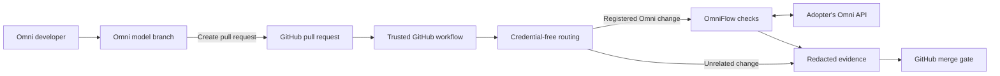
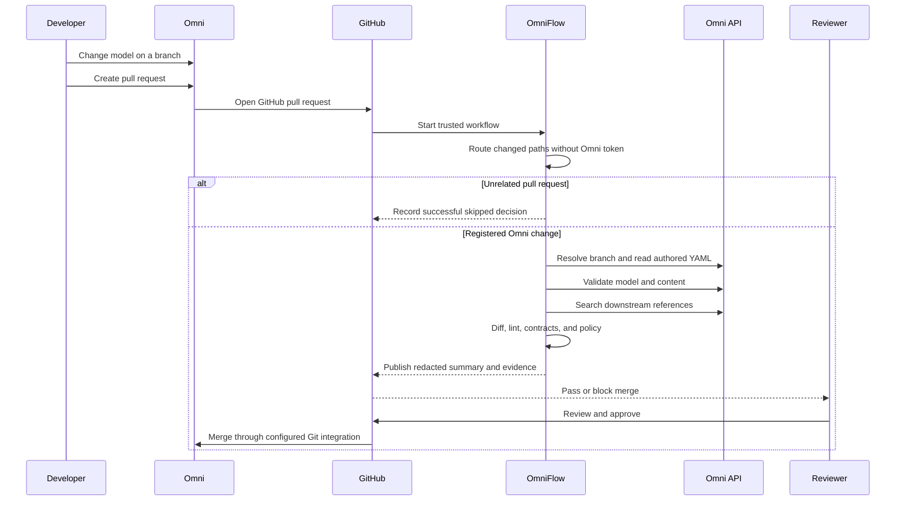
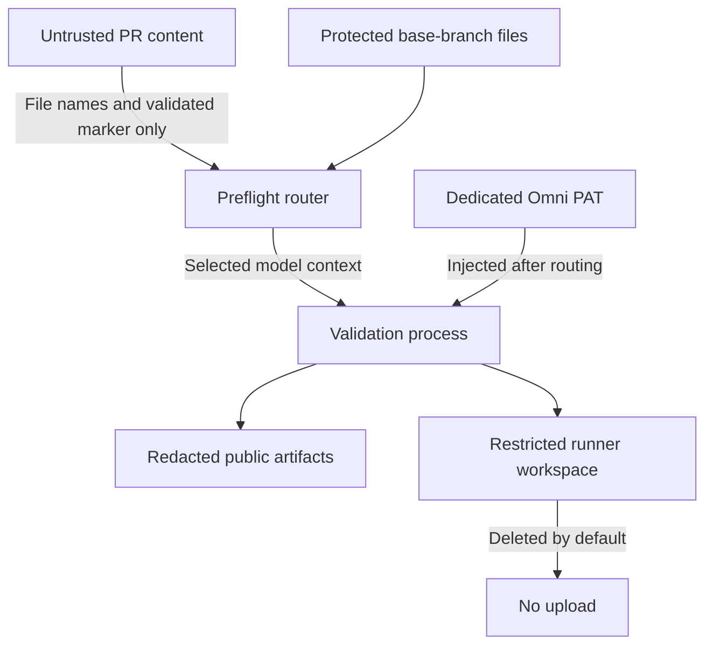
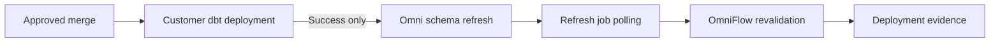

# OmniFlow Architecture And Process Flow

OmniFlow is a self-hosted GitHub Action and Python CLI. It has no hosted control plane: execution happens on the adopter's GitHub Actions runner, and API requests go directly from that runner to the adopter's Omni instance.

## System Architecture

The trusted base branch owns the workflow, `.omni/flow.json`, and optional `.omniflow.yml`. Pull-request changes cannot replace those files for the privileged run. Routing completes before the dedicated Omni token is made available to validation.

## Pull-Request Process

OmniFlow does not perform the final merge or branch promotion. GitHub branch protection owns the merge gate, and the adopter's Omni Git integration owns post-merge synchronization behavior.

## Validation Pipeline

For each selected model, `omniflow run --auto` performs the enabled stages in one policy decision:

1. Resolve the GitHub branch to an Omni branch ID.
2. Retrieve base and branch authored YAML with checksums.
3. Run Omni model validation.
4. Run the Omni Content Validator for branch and base comparison.
5. Parse semantic YAML and calculate structural changes.
6. Apply semantic lint and governance rules.
7. Search visible downstream content for changed-object references.
8. Optionally retrieve dbt exposure metadata.
9. Evaluate validation, contract, coverage, and policy gates.
10. Write redacted public reports and an artifact-integrity manifest.

Multi-model repositories run every model selected by changed-path routing and aggregate their results into one exit decision.

## Security Boundaries

Key controls:

- The privileged workflow never checks out or executes pull-request-head code.
- `base_url`, model registration, policy, and action code come from the protected base branch.
- Fork pull requests never receive the Omni token.
- API headers and secret-like values are redacted from errors and logs.
- Public artifacts omit raw payloads, query results, document URLs, owner emails, and restricted model content.
- Restricted artifacts are deleted by default and are absent from the example upload step.
- All third-party GitHub Actions are pinned to full commit SHAs.

## Optional dbt Deployment Flow

This optional mode is a post-deployment synchronization stage. It does not run dbt, verify warehouse rows, roll back dbt, or make a multi-connection refresh transactional. See [Post-Deployment dbt Synchronization](DBT_SYNC.md).

## Component Map

| Component | Responsibility |
| --- | --- |
| `action.yml` | Hash-locked installation, credential-free routing, mode selection, and secret scoping. |
| `omniflow.discovery` and `omniflow.trust` | Trusted model selection, GitHub event validation, and fork behavior. |
| `omniflow.omni_client` | Timeouts, retries, sanitized failures, and documented Omni API calls. |
| `omniflow.validators` | Model, content, and semantic lint findings. |
| `omniflow.diff` and `omniflow.contracts` | Semantic change detection, risk classification, and referenced-breaking-change policy. |
| `omniflow.downstream` and `omniflow.exposures` | Downstream content searches and optional dbt lineage enrichment. |
| `omniflow.reporting` and `omniflow.artifacts` | Redacted reviewer reports, evidence, and artifact integrity. |
| `omniflow.dbt_sync` | Protected schema refresh orchestration and asynchronous job status handling. |

Read [Limitations And Support Boundary](LIMITATIONS.md) before interpreting any diagram as a guarantee of tenant-specific API coverage or production readiness.
